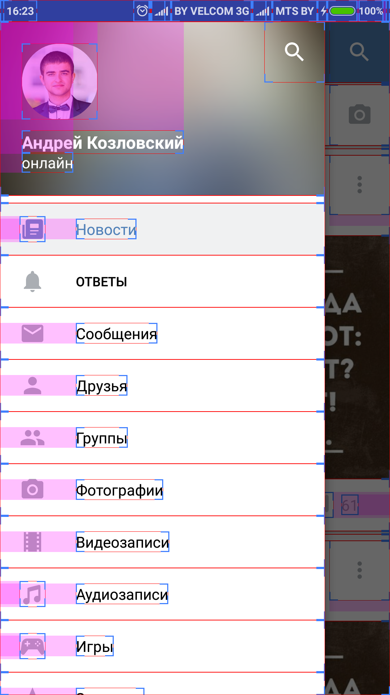

# HW-Layouts-03.10.16

Sorry for my hardcoding, I tried to use only .xml

https://drive.google.com/drive/folders/0B7UUJkY-iuxVRHRVeEVhc3p3REE screenshots here

https://github.com/Andrei1993ak/HW-Logins-03.10.2016 - my HW Logins

now it is a button (with drawable inside)

